# CI/CD 파이프라인 가이드

## 📋 개요

이 프로젝트는 GitHub Actions를 사용하여 자동화된 CI/CD 파이프라인을 구성합니다.

## 🔄 워크플로우 구조

### 1. 트리거 조건
- `main` 브랜치에 push
- `develop` 브랜치에 push  
- `main` 브랜치로의 Pull Request

### 2. 파이프라인 단계

```mermaid
graph LR
    A[코드 푸시] --> B[테스트 실행]
    B --> C[Docker 이미지 빌드]
    C --> D[이미지 푸시]
    D --> E[배포]
```



#### Stage 1: 테스트 (test)
- **Node.js 버전**: 18.x, 20.x에서 매트릭스 테스트
- **Backend 테스트**: Jest 단위 테스트 실행
- **Frontend 테스트**: Vitest 테스트 실행
- **린팅**: ESLint 코드 품질 검사
- **빌드 테스트**: 프로덕션 빌드 확인

#### Stage 2: 빌드 및 푸시 (build-and-push)
- **조건**: `main` 브랜치 푸시 시에만 실행
- **레지스트리**: GitHub Container Registry (ghcr.io)
- **이미지 태깅**:
  - `latest`: main 브랜치 기본 태그
  - `main-{sha}`: 커밋 SHA 기반 태그
  - `main`: 브랜치명 태그

#### Stage 3: 배포 (deploy)
- **조건**: 이미지 빌드 성공 후 실행
- **현재 상태**: 알림만 (실제 배포 스크립트는 환경에 따라 추가)

## 🐳 Docker 이미지

### Frontend 이미지
- **베이스**: nginx:alpine
- **빌드 도구**: Vite
- **포트**: 80
- **이미지명**: `ghcr.io/{username}/{repo}/frontend:latest`

### Backend 이미지
- **베이스**: node:18-alpine
- **런타임**: Node.js
- **포트**: 3001
- **이미지명**: `ghcr.io/{username}/{repo}/backend:latest`

## 🚀 배포 방법

### 1. 자동 배포 (권장)
```bash
# main 브랜치에 코드 푸시
git add .
git commit -m "feat: 새로운 기능 추가"
git push origin main
```

### 2. 수동 배포
```bash
# Docker 이미지 직접 빌드
docker build -t div4u-frontend ./frontend
docker build -t div4u-backend ./backend

# Kubernetes 배포
kubectl apply -f k8s/
```

## 📦 패키지 관리

### GitHub Packages 접근
```bash
# 로그인
echo $GITHUB_TOKEN | docker login ghcr.io -u USERNAME --password-stdin

# 이미지 풀
docker pull ghcr.io/{username}/{repo}/frontend:latest
docker pull ghcr.io/{username}/{repo}/backend:latest
```

## 🔧 환경 설정

### 필수 GitHub Secrets
현재는 `GITHUB_TOKEN`만 사용 (자동 제공)

### 추가 설정이 필요한 경우
```yaml
# .github/workflows/ci-cd.yml에 추가
env:
  SEOUL_API_KEY: ${{ secrets.SEOUL_API_KEY }}
  DATABASE_URL: ${{ secrets.DATABASE_URL }}
```

## 🏗️ 로컬 개발 환경

### 개발 서버 실행
```bash
# Backend
cd backend
npm install
npm run dev

# Frontend  
cd frontend
npm install
npm run dev
```

### Docker Compose로 전체 실행
```bash
# 개발 환경
docker-compose -f docker-compose.dev.yml up

# 프로덕션 환경
docker-compose up
```

## 🔍 모니터링 및 로그

### GitHub Actions 로그 확인
1. GitHub 저장소 → Actions 탭
2. 워크플로우 실행 내역 확인
3. 각 단계별 로그 상세 확인

### 배포 상태 확인
```bash
# Kubernetes 클러스터에서
kubectl get pods -n div4u
kubectl logs -f deployment/frontend -n div4u
kubectl logs -f deployment/backend -n div4u
```

## 🐛 트러블슈팅

### 일반적인 문제들

#### 1. 테스트 실패
```bash
# 로컬에서 테스트 실행
npm run test
npm run lint
```

#### 2. Docker 빌드 실패
```bash
# 로컬에서 빌드 테스트
docker build -t test-image ./frontend
docker build -t test-image ./backend
```

#### 3. 이미지 푸시 권한 오류
- GitHub 저장소 Settings → Actions → General
- Workflow permissions를 "Read and write permissions"로 설정

#### 4. 배포 실패
```bash
# Kubernetes 리소스 상태 확인
kubectl describe deployment frontend -n div4u
kubectl describe deployment backend -n div4u
```

## 📈 성능 최적화

### 빌드 시간 단축
- Docker 레이어 캐싱 활용
- 멀티스테이지 빌드 사용
- 불필요한 파일 .dockerignore에 추가

### 이미지 크기 최적화
- Alpine 베이스 이미지 사용
- 불필요한 의존성 제거
- 프로덕션 빌드 최적화

## 🔄 브랜치 전략 (선택사항)

현재는 main 브랜치만 사용하지만, 팀이 성장하면 다음 전략 고려:

### Git Flow (간소화 버전)
```bash
# 기능 개발
git checkout -b feature/new-feature
git commit -m "feat: 새 기능 추가"
git push origin feature/new-feature

# Pull Request 생성 후 main에 머지
```

### 현재 권장 방식 (단순)
```bash
# 직접 main에 푸시
git add .
git commit -m "feat: 새 기능 추가"
git push origin main
```

## 📞 지원 및 문의

- **이슈 리포팅**: GitHub Issues 사용
- **문서 업데이트**: 이 파일을 직접 수정하여 PR 생성
- **긴급 문의**: 팀 채널 활용

---

## 🎯 다음 단계

1. **모니터링 추가**: Prometheus, Grafana 연동
2. **보안 강화**: 취약점 스캔 도구 추가
3. **성능 테스트**: 부하 테스트 자동화
4. **알림 설정**: Slack, Discord 연동

이 가이드는 프로젝트 진행에 따라 지속적으로 업데이트됩니다.