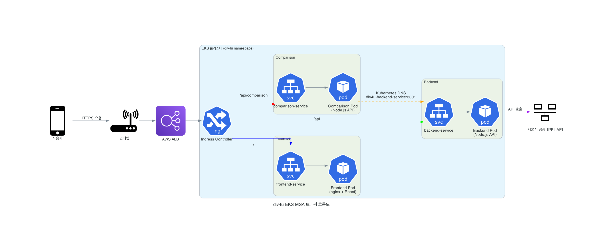

# div4u EKS MSA 트래픽 흐름도 📊

## 🏗️ 아키텍처 다이어그램



## 🌐 트래픽 흐름 상세 설명

### 1. 외부 트래픽 진입
```
사용자 → 인터넷 → AWS ALB → EKS Ingress Controller
```

- **사용자**: 웹 브라우저에서 HTTPS 요청
- **AWS ALB**: Application Load Balancer가 SSL 터미네이션 및 로드밸런싱
- **Ingress Controller**: Kubernetes 내부로 트래픽 라우팅

### 2. Ingress 라우팅 규칙

#### 🔵 Frontend 트래픽 (`/`)
```
Ingress → frontend-service → Frontend Pod (nginx + React)
```
- **경로**: `/` (모든 정적 파일 및 SPA 라우팅)
- **포트**: 80
- **역할**: React SPA 정적 파일 서빙

#### 🟢 Backend API 트래픽 (`/api`)
```
Ingress → backend-service → Backend Pod (Node.js API)
```
- **경로**: `/api/*` (일반 API 요청)
- **포트**: 3001
- **역할**: 서울시 혼잡도 API, NLP 처리

#### 🔴 Comparison API 트래픽 (`/api/comparison`)
```
Ingress → comparison-service → Comparison Pod (Node.js API)
```
- **경로**: `/api/comparison/*` (비교 분석 API)
- **포트**: 3002
- **역할**: V1/V2 비교, 성능 분석

### 3. 클러스터 내부 통신

#### 🟠 Service-to-Service 통신
```
Comparison Pod → div4u-backend-service:3001 → Backend Pod
```
- **방식**: Kubernetes Service DNS
- **주소**: `div4u-backend-service:3001`
- **프로토콜**: HTTP (클러스터 내부)
- **용도**: Comparison 서비스가 Backend API 호출

### 4. 외부 API 연동

#### 🟣 서울시 공공데이터 API
```
Backend Pod → 서울시 공공데이터 API
```
- **엔드포인트**: `http://openapi.seoul.go.kr:8088`
- **용도**: 실시간 혼잡도 데이터 수집

## 🔄 경로 우선순위

Ingress에서 경로 매칭 순서 (중요!):

1. **`/api/comparison`** (가장 구체적) → Comparison Service
2. **`/api`** (일반적) → Backend Service  
3. **`/`** (기본) → Frontend Service

> ⚠️ **주의**: 더 구체적인 경로가 먼저 와야 올바르게 라우팅됩니다.

## 🏷️ 서비스 디스커버리

### Kubernetes DNS 방식
```yaml
# ConfigMap 설정
CORE_API_URL: "http://div4u-backend-service:3001/api"
```

### DNS 해석
- **같은 네임스페이스**: `service-name`
- **다른 네임스페이스**: `service-name.namespace.svc.cluster.local`
- **포트**: Service에서 정의된 포트 사용

## 🔒 보안 고려사항

### SSL/TLS
- **AWS Certificate Manager**: 인증서 자동 관리
- **ALB SSL 터미네이션**: HTTPS → HTTP 변환
- **클러스터 내부**: HTTP 통신 (보안 네트워크)

### 네트워크 정책
- **Frontend**: 외부 접근 가능 (포트 80)
- **Backend/Comparison**: 클러스터 내부에서만 접근
- **Service Discovery**: Kubernetes DNS 사용

## 📊 성능 최적화

### 로드밸런싱
- **ALB**: 다중 AZ 분산
- **Kubernetes Service**: Pod 간 로드밸런싱
- **HPA**: 자동 스케일링

### 캐싱
- **Frontend**: nginx 정적 파일 캐싱
- **Backend**: 서울시 API 응답 캐싱
- **Comparison**: 비교 결과 메모리 캐싱

## 🚀 배포 플로우

```
GitHub Push → GitHub Actions → Docker Build → 
GitHub Container Registry → EKS 자동 배포
```

### CI/CD 파이프라인
1. **코드 푸시**: GitHub에 코드 커밋
2. **자동 빌드**: GitHub Actions 워크플로우 실행
3. **이미지 빌드**: Docker 이미지 생성
4. **레지스트리 푸시**: GitHub Container Registry에 저장
5. **자동 배포**: EKS 클러스터에 롤링 업데이트

## 🔍 모니터링 포인트

### 트래픽 모니터링
- **ALB 메트릭**: 요청 수, 응답 시간, 에러율
- **Ingress 메트릭**: 라우팅 성공률
- **Service 메트릭**: 내부 통신 지연시간

### 애플리케이션 모니터링
- **Frontend**: 정적 파일 서빙 성능
- **Backend**: API 응답 시간, 서울시 API 연동 상태
- **Comparison**: 비교 분석 처리 시간

## 📝 트러블슈팅

### 일반적인 문제
1. **경로 라우팅 오류**: Ingress 경로 순서 확인
2. **Service Discovery 실패**: DNS 이름 및 포트 확인
3. **SSL 인증서 문제**: ACM 인증서 상태 확인
4. **Pod 통신 실패**: Service 및 Endpoint 상태 확인

### 디버깅 명령어
```bash
# Ingress 상태 확인
kubectl get ingress -n div4u

# Service 상태 확인
kubectl get svc -n div4u

# Pod 로그 확인
kubectl logs -f deployment/div4u-backend -n div4u

# DNS 해석 테스트
kubectl exec -it pod-name -n div4u -- nslookup div4u-backend-service
```

---

이 문서는 div4u 서비스의 EKS MSA 아키텍처에서의 트래픽 흐름을 상세히 설명합니다.
