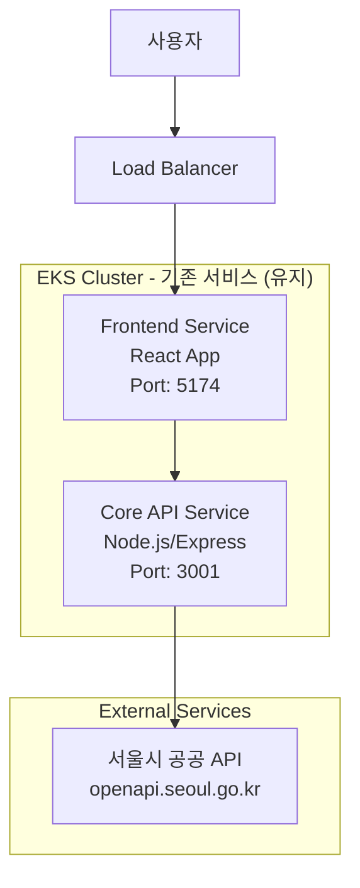
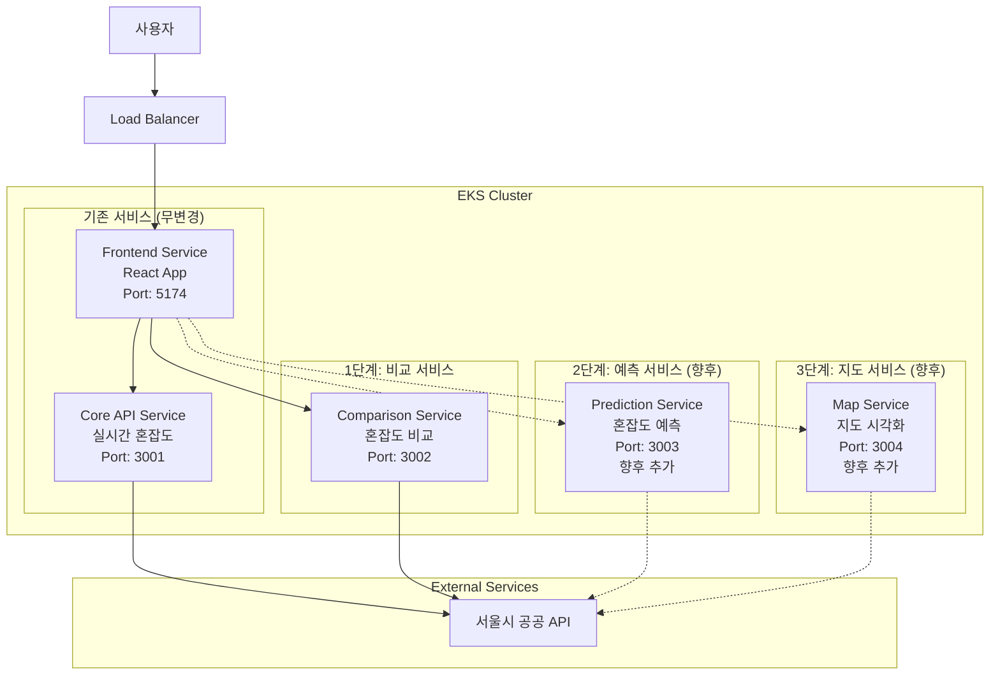
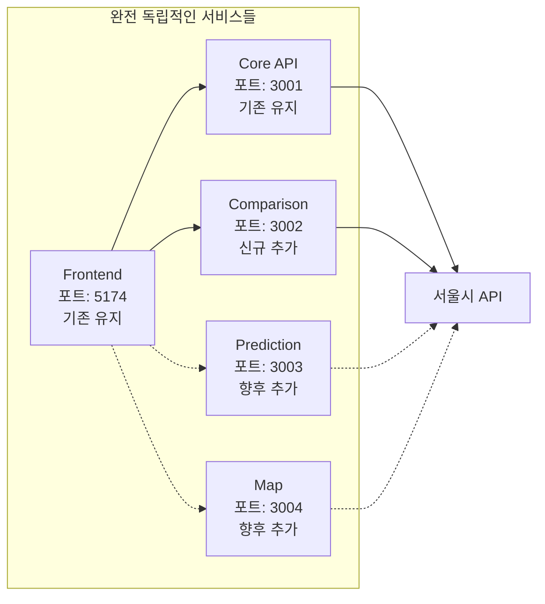
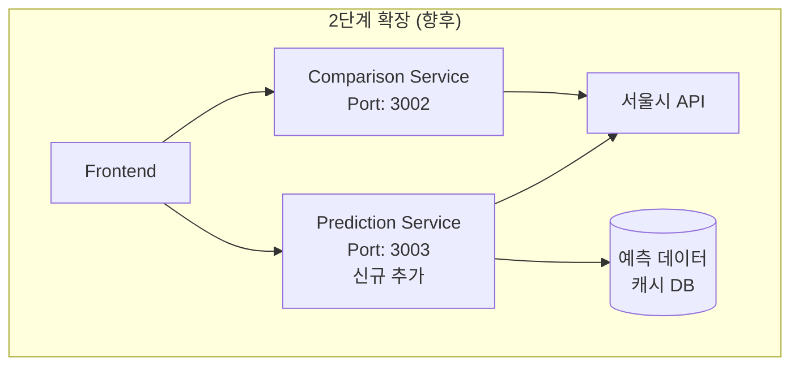
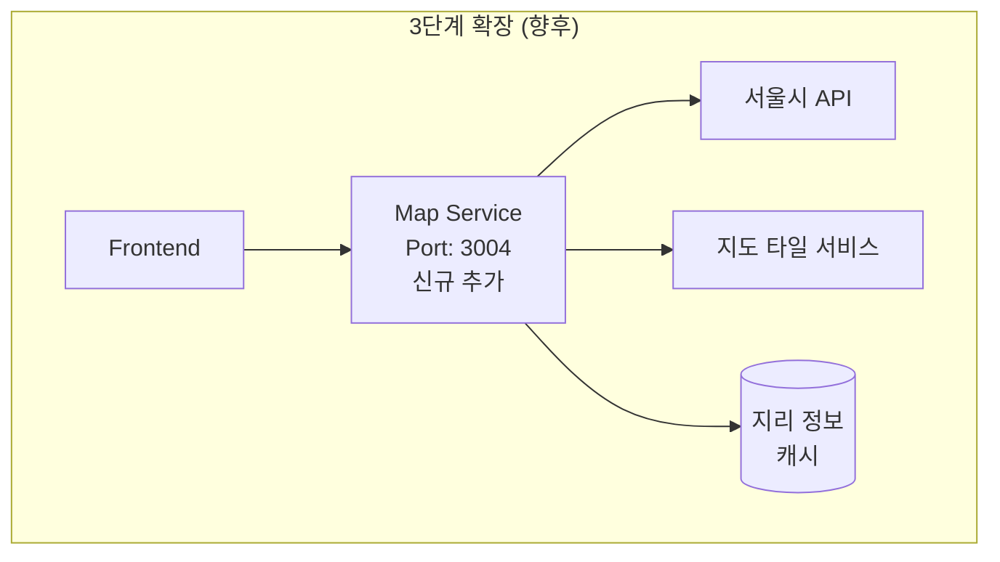

# Design Document

## Overview

div4u 서울 혼잡도 서비스를 점진적으로 마이크로서비스 아키텍처로 확장하는 설계입니다. 기존 서비스(Frontend + Core API)는 완전히 그대로 유지하면서, 새로운 기능들을 독립적인 마이크로서비스로 추가합니다. 첫 번째 단계로 혼잡도 비교 서비스를 구현하고, 향후 예측 및 지도 서비스를 단계적으로 확장할 예정입니다.

## Architecture

### Current System Architecture (유지)



### Extended MSA Architecture (단계적 확장)



### Service Independence Design



## Components and Interfaces

### 1단계: Comparison Service 구현

#### Service Architecture

```typescript
// Comparison Service 독립적인 구조
interface ComparisonServiceArchitecture {
  // 완전히 별도의 프로젝트
  projectPath: "comparison-service/";
  port: 3002;
  
  // 독립적인 의존성
  dependencies: {
    express: "^4.18.0";
    axios: "^1.6.0";
    cors: "^2.8.5";
    dotenv: "^16.0.0";
  };
  
  // 독립적인 환경변수
  environment: {
    PORT: 3002;
    SEOUL_API_KEY: "별도 관리";
    NODE_ENV: "development | production";
  };
}
```

#### API Endpoints Design

```typescript
// Comparison Service RESTful API
interface ComparisonServiceAPI {
  // 여러 장소 동시 비교
  "POST /api/comparison/compare": {
    request: {
      locations: string[];  // ["홍대", "강남", "명동"]
      options?: {
        includeRecommendation: boolean;
        sortBy: "crowdLevel" | "location";
      };
    };
    response: {
      success: boolean;
      data: {
        comparisons: ComparisonResult[];
        analysis: ComparisonAnalysis;
        timestamp: string;
      };
      error?: string;
    };
  };
  
  // 헬스체크 (독립적)
  "GET /api/comparison/health": {
    response: {
      status: "healthy" | "unhealthy";
      service: "comparison-service";
      version: "1.0.0";
      timestamp: string;
    };
  };
}

interface ComparisonResult {
  location: string;
  displayName: string;
  crowdLevel: "붐빔" | "약간 붐빔" | "보통" | "여유";
  message: string;
  timestamp: string;
  rank: number;  // 혼잡도 순위
}

interface ComparisonAnalysis {
  mostCrowded: {
    location: string;
    crowdLevel: string;
  };
  leastCrowded: {
    location: string;
    crowdLevel: string;
  };
  averageCrowdLevel: {
    level: string;
    score: number;  // 1-4 점수 (여유:1, 보통:2, 약간붐빔:3, 붐빔:4)
  };
  recommendation: {
    bestChoice: string;
    reason: string;
    alternativeOptions: string[];
  };
  statistics: {
    totalLocations: number;
    crowdLevelDistribution: {
      여유: number;
      보통: number;
      약간붐빔: number;
      붐빔: number;
    };
  };
}
```

### Frontend Integration (기존 코드 최소 수정)

#### 새로운 API 서비스 추가

```typescript
// frontend/src/services/comparisonApi.ts (신규 파일)
class ComparisonApiService {
  private baseURL = process.env.VITE_COMPARISON_API_URL || 'http://localhost:3002';
  
  async compareLocations(locations: string[]): Promise<ComparisonResponse> {
    try {
      const response = await axios.post(`${this.baseURL}/api/comparison/compare`, {
        locations,
        options: {
          includeRecommendation: true,
          sortBy: "crowdLevel"
        }
      });
      return response.data;
    } catch (error) {
      // 새로운 서비스 실패 시 기존 서비스에 영향 없음
      throw new Error('비교 서비스 일시 불가');
    }
  }
}

export const comparisonApi = new ComparisonApiService();
```

#### 기존 컴포넌트 활용

```typescript
// 기존 CongestionComparison 컴포넌트 활용
// frontend/src/components/CongestionComparison.tsx (기존 파일 수정)

const CongestionComparison: React.FC<CongestionComparisonProps> = ({
  initialItems = [],
  className
}) => {
  // 기존 로직 유지하되, API 호출만 새로운 서비스로 변경
  const handleCompareLocations = async (locations: string[]) => {
    try {
      // 새로운 Comparison Service 호출
      const result = await comparisonApi.compareLocations(locations);
      setComparisonResults(result.data.comparisons);
      setAnalysis(result.data.analysis);
    } catch (error) {
      // 실패 시 기존 방식으로 폴백 (Core API 개별 호출)
      console.warn('Comparison service unavailable, falling back to individual calls');
      await handleFallbackComparison(locations);
    }
  };
  
  // 기존 UI 로직 그대로 유지
  return (
    // 기존 JSX 그대로 유지
  );
};
```

### Data Models

#### Comparison Service Data Models

```typescript
// comparison-service/src/types/index.ts
interface LocationQuery {
  originalQuery: string;
  extractedLocation: string;
  matchedAreaName: string;
  confidence: number;
}

interface SeoulAPIResponse {
  AREA_NM: string;
  AREA_CONGEST_LVL: string;
  AREA_CONGEST_MSG: string;
  PPLTN_TIME: string;
}

interface ComparisonRequest {
  locations: string[];
  options?: {
    includeRecommendation?: boolean;
    sortBy?: 'crowdLevel' | 'location';
    maxLocations?: number;
  };
}

interface ComparisonServiceError {
  code: string;
  message: string;
  details?: any;
  timestamp: string;
}
```

#### Frontend Data Models (기존 유지 + 확장)

```typescript
// frontend/src/types/comparison.ts (신규 파일)
interface ComparisonServiceResponse {
  success: boolean;
  data: {
    comparisons: ComparisonResult[];
    analysis: ComparisonAnalysis;
    timestamp: string;
  };
  error?: string;
}

// 기존 타입들은 그대로 유지
// frontend/src/types/index.ts (기존 파일 무변경)
```

## Error Handling

### Service Isolation Error Handling

#### Comparison Service 독립적 에러 처리

```typescript
// comparison-service/src/middleware/errorHandler.ts
class ComparisonServiceErrorHandler {
  // 서울시 API 오류 (독립적 처리)
  handleSeoulAPIError(error: any): ComparisonServiceError {
    return {
      code: 'SEOUL_API_ERROR',
      message: '서울시 API 연결 실패',
      details: error.message,
      timestamp: new Date().toISOString()
    };
  }
  
  // 자연어 처리 오류 (독립적 처리)
  handleNLPError(query: string): ComparisonServiceError {
    return {
      code: 'LOCATION_NOT_FOUND',
      message: `장소를 찾을 수 없습니다: ${query}`,
      timestamp: new Date().toISOString()
    };
  }
  
  // 서비스 과부하 처리
  handleOverloadError(): ComparisonServiceError {
    return {
      code: 'SERVICE_OVERLOAD',
      message: '비교 서비스 일시 과부하',
      timestamp: new Date().toISOString()
    };
  }
}
```

#### Frontend Fallback Strategy

```typescript
// frontend/src/services/comparisonApi.ts
class ComparisonApiService {
  async compareLocations(locations: string[]): Promise<ComparisonResponse> {
    try {
      // 1차: 새로운 Comparison Service 시도
      return await this.callComparisonService(locations);
    } catch (error) {
      console.warn('Comparison service failed, using fallback');
      
      // 2차: 기존 Core API 개별 호출로 폴백
      return await this.fallbackToIndividualCalls(locations);
    }
  }
  
  private async fallbackToIndividualCalls(locations: string[]): Promise<ComparisonResponse> {
    // 기존 Core API를 여러 번 호출하여 비교 결과 생성
    const results = await Promise.allSettled(
      locations.map(location => coreApi.getCongestion(location))
    );
    
    // 결과를 Comparison Service 형태로 변환
    return this.formatFallbackResults(results);
  }
}
```

### Graceful Degradation

```typescript
// 서비스별 독립적 상태 관리
interface ServiceStatus {
  coreApi: 'healthy' | 'degraded' | 'down';
  comparisonService: 'healthy' | 'degraded' | 'down';
  predictionService: 'healthy' | 'degraded' | 'down';  // 향후
  mapService: 'healthy' | 'degraded' | 'down';         // 향후
}

// 서비스 상태에 따른 UI 조정
const ServiceStatusProvider: React.FC = ({ children }) => {
  const [serviceStatus, setServiceStatus] = useState<ServiceStatus>({
    coreApi: 'healthy',
    comparisonService: 'healthy',
    predictionService: 'healthy',
    mapService: 'healthy'
  });
  
  // 각 서비스 독립적 헬스체크
  useEffect(() => {
    const checkServices = async () => {
      // 기존 서비스는 항상 우선 보장
      const coreStatus = await checkCoreApiHealth();
      
      // 새로운 서비스들은 실패해도 기존 서비스에 영향 없음
      const compStatus = await checkComparisonServiceHealth().catch(() => 'down');
      
      setServiceStatus({
        coreApi: coreStatus,
        comparisonService: compStatus,
        predictionService: 'down',  // 아직 미구현
        mapService: 'down'          // 아직 미구현
      });
    };
    
    checkServices();
    const interval = setInterval(checkServices, 30000);
    return () => clearInterval(interval);
  }, []);
  
  return (
    <ServiceStatusContext.Provider value={serviceStatus}>
      {children}
    </ServiceStatusContext.Provider>
  );
};
```

## Testing Strategy

### Independent Service Testing

#### Comparison Service 독립 테스트

```typescript
// comparison-service/tests/integration.test.ts
describe('Comparison Service Integration Tests', () => {
  // 기존 서비스와 완전 독립적인 테스트
  test('should compare multiple locations independently', async () => {
    const response = await request(app)
      .post('/api/comparison/compare')
      .send({
        locations: ['홍대', '강남', '명동']
      });
    
    expect(response.status).toBe(200);
    expect(response.body.success).toBe(true);
    expect(response.body.data.comparisons).toHaveLength(3);
  });
  
  test('should handle Seoul API failure gracefully', async () => {
    // 서울시 API 실패 시뮬레이션
    mockSeoulAPI.mockRejectedValue(new Error('API Error'));
    
    const response = await request(app)
      .post('/api/comparison/compare')
      .send({
        locations: ['홍대']
      });
    
    expect(response.status).toBe(500);
    expect(response.body.error).toContain('서울시 API');
  });
  
  test('should not affect core API service', async () => {
    // Comparison Service가 다운되어도 Core API는 정상 작동
    const coreApiResponse = await axios.get('http://localhost:3001/api/health');
    expect(coreApiResponse.status).toBe(200);
  });
});
```

#### Frontend Integration Testing

```typescript
// frontend/src/components/__tests__/CongestionComparison.test.tsx
describe('CongestionComparison with MSA', () => {
  test('should use comparison service when available', async () => {
    // Comparison Service 정상 응답 모킹
    mockComparisonAPI.mockResolvedValue({
      success: true,
      data: {
        comparisons: mockComparisonResults,
        analysis: mockAnalysis
      }
    });
    
    render(<CongestionComparison />);
    
    // 비교 서비스 호출 확인
    await waitFor(() => {
      expect(mockComparisonAPI).toHaveBeenCalledWith(['홍대', '강남']);
    });
  });
  
  test('should fallback to core API when comparison service fails', async () => {
    // Comparison Service 실패 모킹
    mockComparisonAPI.mockRejectedValue(new Error('Service down'));
    
    // Core API 정상 응답 모킹
    mockCoreAPI.mockResolvedValue(mockCongestionData);
    
    render(<CongestionComparison />);
    
    // 폴백 동작 확인
    await waitFor(() => {
      expect(mockCoreAPI).toHaveBeenCalledTimes(2); // 개별 호출
    });
  });
});
```

### End-to-End Testing Strategy

```typescript
// e2e/comparison-service.spec.ts
describe('MSA Comparison Service E2E', () => {
  test('existing services should work when comparison service is down', async () => {
    // Comparison Service 중단
    await stopComparisonService();
    
    // 기존 실시간 혼잡도 서비스는 정상 작동해야 함
    await page.goto('http://localhost:5174');
    await page.click('[data-testid="realtime-service"]');
    
    await page.fill('input[placeholder*="장소"]', '홍대');
    await page.click('button:has-text("검색")');
    
    // 기존 서비스 정상 작동 확인
    await expect(page.locator('[data-testid="congestion-result"]')).toBeVisible();
  });
  
  test('comparison service should work independently', async () => {
    await page.goto('http://localhost:5174/comparison');
    
    // 여러 장소 추가
    await page.fill('input[placeholder*="비교할 장소"]', '홍대');
    await page.press('input[placeholder*="비교할 장소"]', 'Enter');
    
    await page.fill('input[placeholder*="비교할 장소"]', '강남');
    await page.press('input[placeholder*="비교할 장소"]', 'Enter');
    
    // 비교 결과 확인
    await expect(page.locator('[data-testid="comparison-analysis"]')).toBeVisible();
    await expect(page.locator('[data-testid="most-crowded"]')).toBeVisible();
    await expect(page.locator('[data-testid="least-crowded"]')).toBeVisible();
  });
});
```

## Deployment Architecture

### Independent Service Deployment

#### Comparison Service Containerization

```dockerfile
# comparison-service/Dockerfile
FROM node:18-alpine

WORKDIR /app

# 독립적인 의존성 설치
COPY package*.json ./
RUN npm ci --only=production

# 소스 코드 복사
COPY . .

# 독립적인 포트 노출
EXPOSE 3002

# 헬스체크 설정
HEALTHCHECK --interval=30s --timeout=3s --start-period=5s --retries=3 \
  CMD curl -f http://localhost:3002/api/comparison/health || exit 1

CMD ["npm", "start"]
```

#### Kubernetes Deployment (별도 디렉터리 관리)

**중요: 기존 k8s/ 디렉터리는 수정하지 않음**

```yaml
# comparison-service/k8s/deployment.yaml (새로운 디렉터리)
apiVersion: apps/v1
kind: Deployment
metadata:
  name: comparison-service
  namespace: div4u
spec:
  replicas: 2
  selector:
    matchLabels:
      app: comparison-service
  template:
    metadata:
      labels:
        app: comparison-service
    spec:
      containers:
      - name: comparison-service
        image: div4u/comparison-service:latest
        ports:
        - containerPort: 3002
        env:
        - name: PORT
          value: "3002"
        - name: SEOUL_API_KEY
          value: "${SEOUL_API_KEY}"  # 환경변수로 주입
        resources:
          requests:
            memory: "256Mi"
            cpu: "200m"
          limits:
            memory: "512Mi"
            cpu: "500m"
        livenessProbe:
          httpGet:
            path: /api/comparison/health
            port: 3002
          initialDelaySeconds: 30
          periodSeconds: 10

---
apiVersion: v1
kind: Service
metadata:
  name: comparison-service
  namespace: div4u
spec:
  selector:
    app: comparison-service
  ports:
  - port: 3002
    targetPort: 3002
  type: ClusterIP
```

#### Service Discovery (기존 설정 활용)

```typescript
// 기존 Ingress나 Service Mesh 설정은 건드리지 않음
// 대신 프론트엔드에서 직접 서비스 디스커버리

// frontend/src/config/services.ts
const SERVICE_CONFIG = {
  coreAPI: process.env.VITE_CORE_API_URL || 'http://localhost:3001',
  comparisonAPI: process.env.VITE_COMPARISON_API_URL || 'http://localhost:3002',
  // 향후 서비스들
  predictionAPI: process.env.VITE_PREDICTION_API_URL || 'http://localhost:3003',
  mapAPI: process.env.VITE_MAP_API_URL || 'http://localhost:3004'
};

export default SERVICE_CONFIG;
```

### Monitoring & Observability

#### Independent Service Monitoring (기존 모니터링 시스템 활용)

```typescript
// comparison-service/src/monitoring/metrics.ts
// 기존 모니터링 시스템에 연결하는 방식으로 구현
class ComparisonServiceMetrics {
  // 기존 Prometheus/Grafana 시스템에 메트릭 전송
  sendMetricsToExistingSystem() {
    // 기존 모니터링 엔드포인트로 메트릭 전송
    // k8s 설정은 건드리지 않고 애플리케이션 레벨에서 처리
  }
}
```

#### Service Health Dashboard

```typescript
// comparison-service/src/routes/health.ts
import express from 'express';
import { register, collectDefaultMetrics } from 'prom-client';

const router = express.Router();

// Prometheus 메트릭 수집
collectDefaultMetrics();

router.get('/health', (req, res) => {
  res.json({
    status: 'healthy',
    service: 'comparison-service',
    version: process.env.npm_package_version || '1.0.0',
    timestamp: new Date().toISOString(),
    uptime: process.uptime(),
    memory: process.memoryUsage(),
    dependencies: {
      seoulAPI: 'healthy',  // 실제 체크 로직 필요
      database: 'not-used'
    }
  });
});

router.get('/metrics', (req, res) => {
  res.set('Content-Type', register.contentType);
  res.end(register.metrics());
});

export default router;
```

## Performance Considerations

### Service-Specific Optimizations

#### Comparison Service Performance

```typescript
// comparison-service/src/services/comparisonAnalyzer.ts
class ComparisonAnalyzer {
  private cache = new Map<string, any>();
  private readonly CACHE_TTL = 5 * 60 * 1000; // 5분
  
  // 병렬 처리로 성능 향상
  async compareLocationsParallel(locations: string[]): Promise<ComparisonResult[]> {
    const promises = locations.map(async (location) => {
      const cacheKey = `${location}-${Date.now() - (Date.now() % this.CACHE_TTL)}`;
      
      if (this.cache.has(cacheKey)) {
        return this.cache.get(cacheKey);
      }
      
      const result = await this.fetchLocationData(location);
      this.cache.set(cacheKey, result);
      
      return result;
    });
    
    const results = await Promise.allSettled(promises);
    return results
      .filter(result => result.status === 'fulfilled')
      .map(result => (result as PromiseFulfilledResult<any>).value);
  }
  
  // 혼잡도 분석 및 추천 로직
  analyzeComparison(results: ComparisonResult[]): ComparisonAnalysis {
    // 혼잡도 점수 매핑 (여유:1, 보통:2, 약간붐빔:3, 붐빔:4)
    const crowdScores = {
      '여유': 1,
      '보통': 2,
      '약간 붐빔': 3,
      '붐빔': 4
    };
    
    // 평균 혼잡도 계산
    const totalScore = results.reduce((sum, result) => 
      sum + crowdScores[result.crowdLevel], 0);
    const averageScore = totalScore / results.length;
    
    // 평균 혼잡도 레벨 결정
    const averageLevel = this.getAverageCrowdLevel(averageScore);
    
    // 혼잡도별 분포 계산
    const distribution = {
      여유: results.filter(r => r.crowdLevel === '여유').length,
      보통: results.filter(r => r.crowdLevel === '보통').length,
      약간붐빔: results.filter(r => r.crowdLevel === '약간 붐빔').length,
      붐빔: results.filter(r => r.crowdLevel === '붐빔').length
    };
    
    // 최적 선택지 추천
    const bestChoice = this.getBestRecommendation(results);
    const alternatives = this.getAlternativeOptions(results, bestChoice.location);
    
    return {
      mostCrowded: this.getMostCrowded(results),
      leastCrowded: this.getLeastCrowded(results),
      averageCrowdLevel: {
        level: averageLevel,
        score: Math.round(averageScore * 10) / 10
      },
      recommendation: {
        bestChoice: bestChoice.location,
        reason: bestChoice.reason,
        alternativeOptions: alternatives
      },
      statistics: {
        totalLocations: results.length,
        crowdLevelDistribution: distribution
      }
    };
  }
  
  private getBestRecommendation(results: ComparisonResult[]) {
    const leastCrowded = this.getLeastCrowded(results);
    const reasons = {
      '여유': '현재 가장 여유로워서 편안하게 이용할 수 있습니다',
      '보통': '적당한 혼잡도로 무난하게 이용할 수 있습니다',
      '약간 붐빔': '약간 붐비지만 다른 곳보다는 나은 상황입니다',
      '붐빔': '모든 곳이 붐비는 상황이지만 상대적으로 나은 선택입니다'
    };
    
    return {
      location: leastCrowded.location,
      reason: reasons[leastCrowded.crowdLevel]
    };
  }
  
  private getAlternativeOptions(results: ComparisonResult[], bestChoice: string): string[] {
    return results
      .filter(r => r.location !== bestChoice)
      .sort((a, b) => this.getCrowdScore(a.crowdLevel) - this.getCrowdScore(b.crowdLevel))
      .slice(0, 2)  // 상위 2개 대안
      .map(r => r.location);
  }
}
```

#### Resource Isolation

```yaml
# k8s/resource-limits.yaml
apiVersion: v1
kind: ResourceQuota
metadata:
  name: comparison-service-quota
  namespace: div4u
spec:
  hard:
    requests.cpu: "1"
    requests.memory: 1Gi
    limits.cpu: "2"
    limits.memory: 2Gi
    persistentvolumeclaims: "0"  # 상태 없는 서비스

---
apiVersion: policy/v1
kind: PodDisruptionBudget
metadata:
  name: comparison-service-pdb
spec:
  minAvailable: 1
  selector:
    matchLabels:
      app: comparison-service
```

## Scalability Plan

### Horizontal Scaling Strategy

#### Auto Scaling Configuration (별도 관리)

```yaml
# comparison-service/k8s/hpa.yaml (새로운 서비스 전용)
apiVersion: autoscaling/v2
kind: HorizontalPodAutoscaler
metadata:
  name: comparison-service-hpa
  namespace: div4u
spec:
  scaleTargetRef:
    apiVersion: apps/v1
    kind: Deployment
    name: comparison-service
  minReplicas: 1  # 초기에는 최소 리소스로 시작
  maxReplicas: 5
  metrics:
  - type: Resource
    resource:
      name: cpu
      target:
        type: Utilization
        averageUtilization: 70
```

### Future Service Expansion

#### 2단계: Prediction Service 확장 계획



#### 3단계: Map Service 확장 계획



## Security Best Practices

### Service-Level Security

#### API Key Management (환경변수 방식)

```bash
# comparison-service/.env
PORT=3002
SEOUL_API_KEY=your_seoul_api_key_here
NODE_ENV=development

# 프로덕션에서는 Kubernetes Secret 대신 환경변수 주입 방식 사용
# 기존 k8s Secret 설정은 건드리지 않음
```

#### Network Security (애플리케이션 레벨)

```typescript
// comparison-service/src/middleware/security.ts
import cors from 'cors';

// 기존 서비스와 통신 허용
const corsOptions = {
  origin: [
    'http://localhost:5174',  // 개발 환경
    'https://div4u.example.com'  // 프로덕션 환경
  ],
  credentials: true
};

export const securityMiddleware = [
  cors(corsOptions),
  // 기타 보안 미들웨어들
];
```

#### Service Authentication

```typescript
// comparison-service/src/middleware/auth.ts
interface ServiceAuthConfig {
  internalServices: string[];  // ['frontend-service', 'core-api']
  externalAPIs: string[];      // ['openapi.seoul.go.kr']
  rateLimits: {
    perMinute: number;
    perHour: number;
  };
}

class ServiceAuthMiddleware {
  // 내부 서비스 간 인증
  validateInternalRequest(req: Request, res: Response, next: NextFunction) {
    const serviceToken = req.headers['x-service-token'];
    
    if (!this.isValidServiceToken(serviceToken)) {
      return res.status(401).json({
        error: 'Unauthorized service access',
        service: 'comparison-service'
      });
    }
    
    next();
  }
  
  // 외부 API 호출 제한
  rateLimitExternalAPI(req: Request, res: Response, next: NextFunction) {
    // 서울시 API 호출 제한 로직
    const clientIP = req.ip;
    const currentMinute = Math.floor(Date.now() / 60000);
    
    if (this.exceedsRateLimit(clientIP, currentMinute)) {
      return res.status(429).json({
        error: 'Rate limit exceeded',
        service: 'comparison-service'
      });
    }
    
    next();
  }
}
```

이제 디자인 문서가 완성되었습니다. 기존 서비스를 완전히 보호하면서 새로운 비교 서비스를 독립적으로 추가하는 설계입니다.