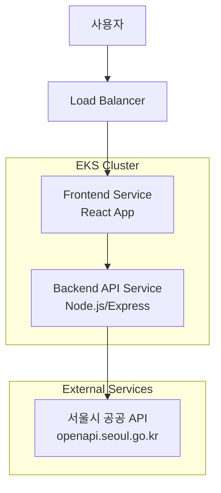

# Design Document

## Overview

서울 실시간 혼잡도 서비스는 서울시 공공 API를 활용하여 사용자가 자연어로 질의한 장소의 혼잡도를 인터랙티브한 캐릭터를 통해 안내하는 웹 애플리케이션입니다. React 기반의 프론트엔드와 Node.js 기반의 백엔드로 구성된 MSA 구조로 설계되어 EKS 클러스터에 배포됩니다.

## Architecture

### System Architecture



### Service Components

1. **Frontend Service (React)**
   - 사용자 인터페이스 제공
   - 캐릭터 애니메이션 및 인터랙션
   - 반응형 웹 디자인
   - Nginx로 정적 파일 서빙

2. **Backend API Service (Node.js/Express)**
   - 자연어 처리 및 장소명 추출
   - 서울시 API 연동
   - 혼잡도 데이터 가공
   - RESTful API 제공

## Components and Interfaces

### Frontend Components

#### Core Components
- `App.tsx`: 메인 애플리케이션 라우터
- `HomePage.tsx`: 메인 페이지 (4개 서비스 카드)
- `CrowdPredictionPage.tsx`: 혼잡도 서비스 페이지
- `CharacterGuide.tsx`: 인터랙티브 캐릭터 컴포넌트

#### UI Components (shadcn/ui 기반)
- `Button`, `Card`, `Input`, `Badge`: 기본 UI 컴포넌트
- 커스텀 애니메이션 및 스타일링

#### Advanced Character Animation System
```typescript
interface CharacterState {
  crowdLevel: "붐빔" | "약간 붐빔" | "보통" | "여유";
  expression: "stressed" | "worried" | "normal" | "happy";
  animation: "shake" | "pulse" | "bounce" | "scale" | "float" | "wiggle";
  aura: "red" | "orange" | "blue" | "green";
  particles: "sweat" | "sparkles" | "hearts" | "stress";
  transition: "smooth" | "bounce" | "elastic";
}

interface AnimationSequence {
  phases: CharacterState[];
  duration: number;
  loop: boolean;
}

// 고급 애니메이션 효과
interface AdvancedEffects {
  // 혼잡도별 복합 애니메이션
  morphing: boolean;        // 캐릭터 형태 변화
  colorShift: boolean;      // 색상 그라데이션 변화
  particleSystem: boolean;  // 파티클 효과
  soundEffects: boolean;    // 사운드 피드백 (선택사항)
}
```

### Backend API Endpoints

#### RESTful API Design
```typescript
// 자연어 질의 처리 및 혼잡도 조회
POST /api/congestion/query
Request: {
  query: string;        // "홍대 혼잡도 어때?"
  serviceType: "realtime" | "prediction";
}
Response: {
  location: string;     // "홍대입구역 일대"
  crowdLevel: string;   // "붐빔"
  message: string;      // 혼잡도 메시지
  timestamp: string;    // 조회 시간
  success: boolean;
}

// 헬스체크
GET /api/health
Response: {
  status: "healthy" | "unhealthy";
  timestamp: string;
}
```

### External API Integration

#### 서울시 공공 API
```typescript
interface SeoulAPIConfig {
  baseURL: "http://openapi.seoul.go.kr:8088";
  apiKey: process.env.SEOUL_API_KEY;  // 환경변수로 관리
  endpoint: "/xml/citydata/1/5/{AREA_NM}";
}

interface SeoulAPIResponse {
  AREA_CONGEST_LVL: string;  // 혼잡도 레벨
  AREA_CONGEST_MSG: string;  // 혼잡도 메시지
  // 기타 응답 필드들
}

// 지원 가능한 장소 목록 (서울시 주요 120장소)
interface SupportedLocation {
  areaCode: string;     // POI001, POI002 등
  areaName: string;     // API 호출용 정확한 장소명 (AREA_NM)
  displayName: string;  // 사용자에게 표시할 이름
  engName: string;      // 영어명
  category: string;     // 관광특구, 대중교통, 중심시가지, 공원 등
  keywords: string[];   // 자연어 매칭용 키워드들
}

// 실제 120개 장소 데이터 구조 (일부 예시)
const SEOUL_LOCATIONS: SupportedLocation[] = [
  // 관광특구
  {
    areaCode: "POI001", areaName: "강남 MICE 관광특구", displayName: "강남 MICE 일대",
    engName: "Gangnam MICE Special Tourist Zone", category: "관광특구",
    keywords: ["강남", "MICE", "마이스", "gangnam", "mice"]
  },
  {
    areaCode: "POI007", areaName: "홍대 관광특구", displayName: "홍대 일대",
    engName: "HongDae Culture & Arts Special Tourist Zone", category: "관광특구", 
    keywords: ["홍대", "홍익대", "홍대입구", "hongdae", "문화", "예술"]
  },
  {
    areaCode: "POI003", areaName: "명동 관광특구", displayName: "명동 일대",
    engName: "Myeong-dong Special Tourist Zone", category: "관광특구",
    keywords: ["명동", "남대문", "북창동", "다동", "무교동", "myeongdong"]
  },
  
  // 인구밀집지역 (지하철역)
  {
    areaCode: "POI014", areaName: "강남역", displayName: "강남역 일대",
    engName: "Gangnam station", category: "인구밀집지역",
    keywords: ["강남역", "강남", "테헤란로", "gangnam", "station"]
  },
  {
    areaCode: "POI055", areaName: "홍대입구역(2호선)", displayName: "홍대입구역 일대",
    engName: "Hongik University station(Line 2)", category: "인구밀집지역",
    keywords: ["홍대입구역", "홍대입구", "홍익대학교", "2호선", "hongik"]
  },
  {
    areaCode: "POI040", areaName: "신촌·이대역", displayName: "신촌·이대역 일대", 
    engName: "Sinchon·Ewha Womans University station", category: "인구밀집지역",
    keywords: ["신촌", "이대", "이화여대", "sinchon", "ewha"]
  },
  
  // 발달상권
  {
    areaCode: "POI059", areaName: "가로수길", displayName: "가로수길 일대",
    engName: "Garosu-gil", category: "발달상권",
    keywords: ["가로수길", "신사동", "압구정", "garosu", "tree"]
  },
  {
    areaCode: "POI078", areaName: "인사동", displayName: "인사동 일대",
    engName: "Insa-dong", category: "발달상권", 
    keywords: ["인사동", "전통", "한옥", "insadong", "traditional"]
  },
  {
    areaCode: "POI073", areaName: "연남동", displayName: "연남동 일대",
    engName: "Yeonnam-dong", category: "발달상권",
    keywords: ["연남동", "연트럴파크", "홍대", "yeonnam"]
  },
  
  // 공원
  {
    areaCode: "POI095", areaName: "반포한강공원", displayName: "반포한강공원",
    engName: "Banpo Hangang Park", category: "공원",
    keywords: ["반포", "한강공원", "한강", "banpo", "hangang", "park"]
  },
  {
    areaCode: "POI101", areaName: "서울숲공원", displayName: "서울숲공원",
    engName: "Seoul Forest", category: "공원",
    keywords: ["서울숲", "성수동", "forest", "seoul"]
  },
  
  // 고궁·문화유산
  {
    areaCode: "POI008", areaName: "경복궁", displayName: "경복궁",
    engName: "Gyeongbokgung Palace", category: "고궁·문화유산",
    keywords: ["경복궁", "궁궐", "광화문", "gyeongbok", "palace"]
  },
  {
    areaCode: "POI009", areaName: "광화문·덕수궁", displayName: "광화문·덕수궁 일대", 
    engName: "Gwanghwamun & Deoksugung Palace", category: "고궁·문화유산",
    keywords: ["광화문", "덕수궁", "궁궐", "gwanghwamun", "deoksu"]
  }
  // ... 총 120개 장소 (실제 구현 시 전체 목록 포함)
];
```

## Data Models

### Frontend Data Models

```typescript
// 페이지 상태 관리
type Page = "home" | "prediction" | "realtime" | "comparison" | "other";

// 검색 결과 모델
interface SearchResult {
  location: string;
  crowdLevel: "붐빔" | "약간 붐빔" | "보통" | "여유";
  message: string;
  time: string;
}

// 서비스 메뉴 모델
interface ServiceItem {
  id: string;
  name: string;
  icon: string;
  available: boolean;
}
```

### Backend Data Models

```typescript
// 자연어 처리 결과 (120개 장소 기반 매칭)
interface NLPResult {
  extractedLocation: string;
  matchedAreaName: string;  // 실제 API 호출용 AREA_NM
  confidence: number;
  originalQuery: string;
  suggestedLocations: string[];  // 유사한 장소 제안
}

// 장소 매칭 시스템
interface LocationMatcher {
  fuzzyMatch: (query: string) => SupportedLocation[];
  exactMatch: (query: string) => SupportedLocation | null;
  keywordMatch: (query: string) => SupportedLocation[];
  categoryMatch: (query: string) => SupportedLocation[];
}

// 자연어 처리 로직
class NaturalLanguageProcessor {
  // "홍대 혼잡도 어때?" → "홍대" 추출
  extractLocationKeywords(query: string): string[] {
    // 불용어 제거 (혼잡도, 어때, 사람, 많나요 등)
    const stopWords = ["혼잡도", "어때", "사람", "많나요", "붐비나요", "여유로운가요"];
    // 장소 관련 키워드만 추출
    return query.split(' ').filter(word => !stopWords.includes(word));
  }
  
  // 키워드를 실제 AREA_NM으로 매핑
  matchToAreaName(keywords: string[]): { areaName: string; confidence: number } {
    // 120개 장소 목록에서 가장 유사한 장소 찾기
    // Levenshtein distance 또는 Jaccard similarity 사용
  }
}

// 서울시 API 응답 파싱 결과
interface CongestionData {
  areaName: string;
  congestionLevel: string;
  congestionMessage: string;
  timestamp: Date;
  rawData: any;
}

// API 응답 모델
interface APIResponse<T> {
  success: boolean;
  data?: T;
  error?: string;
  timestamp: string;
}
```

## Error Handling

### Frontend Error Handling

1. **API 호출 실패**
   - 네트워크 오류 시 재시도 로직
   - 사용자 친화적 오류 메시지 표시
   - 캐릭터를 통한 오류 안내

2. **데이터 로딩 상태**
   - 로딩 스피너와 캐릭터 애니메이션
   - 타임아웃 처리 (30초)

3. **잘못된 입력 처리**
   - 빈 입력값 검증
   - 지원하지 않는 지역 안내

### Backend Error Handling

1. **서울시 API 오류**
   - HTTP 상태 코드별 처리
   - 재시도 로직 (3회, 지수 백오프)
   - 폴백 응답 제공

2. **자연어 처리 오류**
   - 장소명 추출 실패 시 기본값 제공
   - 신뢰도 점수 기반 필터링

3. **시스템 오류**
   - 구조화된 로깅 (Winston)
   - 헬스체크 엔드포인트
   - Graceful shutdown

```typescript
// 에러 처리 미들웨어
interface ErrorResponse {
  error: string;
  message: string;
  statusCode: number;
  timestamp: string;
}
```

## Testing Strategy

### Frontend Testing

1. **Unit Testing (Jest + React Testing Library)**
   - 컴포넌트 렌더링 테스트
   - 사용자 인터랙션 테스트
   - 캐릭터 애니메이션 상태 테스트

2. **Integration Testing**
   - API 호출 및 응답 처리 테스트
   - 페이지 간 네비게이션 테스트

3. **E2E Testing (Playwright)**
   - 전체 사용자 플로우 테스트
   - 반응형 디자인 테스트

### Backend Testing

1. **Unit Testing (Jest)**
   - API 엔드포인트 테스트
   - 자연어 처리 로직 테스트
   - 데이터 변환 로직 테스트

2. **Integration Testing**
   - 서울시 API 연동 테스트 (Mock)
   - 데이터베이스 연동 테스트 (필요시)

3. **API Testing (Supertest)**
   - RESTful API 엔드포인트 테스트
   - 에러 처리 테스트

### Test Coverage Goals
- Frontend: 80% 이상
- Backend: 85% 이상

### Local Testing Strategy
1. **개발 단계별 테스트**
   - 로컬 개발 서버에서 기본 기능 테스트
   - Docker Compose로 컨테이너 환경 테스트
   - 서울시 API 연동 테스트 (실제 API 호출)

2. **통합 테스트 시나리오**
   - 프론트엔드 ↔ 백엔드 API 통신 테스트
   - 자연어 질의 → 장소 추출 → API 호출 → 결과 표시 전체 플로우
   - 캐릭터 애니메이션 및 UI 인터랙션 테스트

## Development Environment

### Local Development Setup

#### Prerequisites
- Node.js 18+ 
- npm 또는 yarn
- Docker (선택사항)

#### Frontend Development
```bash
# React 개발 서버 실행
cd frontend
npm install
npm run dev  # http://localhost:5174
```

#### Backend Development
```bash
# Express 서버 실행
cd backend
npm install
npm run dev  # http://localhost:3001
```

#### Environment Variables
```bash
# backend/.env
SEOUL_API_KEY=your_seoul_api_key_here
SEOUL_API_BASE_URL=http://openapi.seoul.go.kr:8088
PORT=3001
NODE_ENV=development

# frontend/.env
VITE_API_BASE_URL=http://localhost:3001
```

#### Local Testing with Docker Compose
```yaml
# docker-compose.dev.yml
version: '3.8'
services:
  frontend:
    build: 
      context: ./frontend
      dockerfile: Dockerfile.dev
    ports:
      - "5174:5174"
    volumes:
      - ./frontend:/app
      - /app/node_modules
    environment:
      - VITE_API_BASE_URL=http://localhost:3001

  backend:
    build:
      context: ./backend
      dockerfile: Dockerfile.dev
    ports:
      - "3001:3001"
    volumes:
      - ./backend:/app
      - /app/node_modules
    environment:
      - SEOUL_API_KEY=${SEOUL_API_KEY}
      - NODE_ENV=development
```

## Deployment Architecture

### Containerization

#### Frontend Dockerfile
```dockerfile
FROM node:18-alpine AS builder
WORKDIR /app
COPY package*.json ./
RUN npm ci
COPY . .
RUN npm run build

FROM nginx:alpine
COPY --from=builder /app/dist /usr/share/nginx/html
COPY nginx.conf /etc/nginx/nginx.conf
EXPOSE 80
```

#### Backend Dockerfile
```dockerfile
FROM node:18-alpine
WORKDIR /app
COPY package*.json ./
RUN npm ci --only=production
COPY . .
EXPOSE 3000
CMD ["npm", "start"]
```

### Kubernetes Deployment

#### Frontend Service
```yaml
apiVersion: apps/v1
kind: Deployment
metadata:
  name: seoul-congestion-frontend
spec:
  replicas: 2
  selector:
    matchLabels:
      app: seoul-congestion-frontend
  template:
    spec:
      containers:
      - name: frontend
        image: seoul-congestion-frontend:latest
        ports:
        - containerPort: 80
        resources:
          requests:
            memory: "128Mi"
            cpu: "100m"
          limits:
            memory: "256Mi"
            cpu: "200m"
```

#### Backend Service
```yaml
apiVersion: apps/v1
kind: Deployment
metadata:
  name: seoul-congestion-backend
spec:
  replicas: 3
  selector:
    matchLabels:
      app: seoul-congestion-backend
  template:
    spec:
      containers:
      - name: backend
        image: seoul-congestion-backend:latest
        ports:
        - containerPort: 3001
        env:
        - name: SEOUL_API_KEY
          valueFrom:
            secretKeyRef:
              name: seoul-api-secret
              key: api-key
        resources:
          requests:
            memory: "256Mi"
            cpu: "200m"
          limits:
            memory: "512Mi"
            cpu: "500m"
```

### Service Mesh & Monitoring

1. **Service Discovery**
   - Kubernetes DNS 기반 서비스 디스커버리
   - Service와 Ingress를 통한 로드 밸런싱

2. **Monitoring & Logging**
   - Prometheus + Grafana 모니터링
   - ELK Stack 로깅
   - 애플리케이션 메트릭 수집

3. **Security**
   - HTTPS 적용 (Let's Encrypt)
   - API 키 Kubernetes Secret 관리 (하드코딩 방지)
   - CORS 정책 설정
   - 환경변수를 통한 민감 정보 관리

## Performance Considerations

### Frontend Optimization

1. **Code Splitting**
   - 페이지별 lazy loading
   - 컴포넌트 번들 최적화

2. **Asset Optimization**
   - 이미지 최적화 (WebP 변환)
   - 캐릭터.png 압축 및 최적화
   - CSS/JS 압축

3. **Caching Strategy**
   - 브라우저 캐싱 설정
   - CDN 활용 (CloudFront)

### Backend Optimization

1. **API Response Caching**
   - Redis 캐싱 (5분 TTL)
   - 동일 지역 중복 요청 방지

2. **Connection Pooling**
   - HTTP 연결 풀 관리
   - Keep-alive 설정

3. **Rate Limiting**
   - API 호출 제한 (분당 100회)
   - 서울시 API 호출 최적화

## Scalability Plan

### Horizontal Scaling

1. **Frontend Scaling**
   - Nginx 기반 정적 파일 서빙
   - CDN을 통한 글로벌 배포

2. **Backend Scaling**
   - Stateless 서비스 설계
   - Auto Scaling 정책 설정

### Future Extensions

1. **추가 서비스 확장**
   - 혼잡도 예측 서비스 (ML 모델)
   - 혼잡도 비교 서비스
   - 알림 서비스

2. **고급 캐릭터 애니메이션**
   - Lottie 애니메이션 통합
   - 3D 캐릭터 모델링 (Three.js)
   - 음성 피드백 시스템
   - 감정 표현 다양화

3. **API Gateway 도입**
   - Kong 또는 AWS API Gateway
   - 인증/인가 시스템
   - API 버전 관리

## Security Best Practices

### API 키 관리 전략

**로컬 개발 환경:**
```bash
# .env 파일 (git에 커밋하지 않음)
SEOUL_API_KEY=your_seoul_api_key_here
```

**프로덕션 환경 (Kubernetes):**
```yaml
# secret.yaml
apiVersion: v1
kind: Secret
metadata:
  name: seoul-api-secret
type: Opaque
data:
  api-key: NTM1ODY0NmI1NzczNmY2ZjM4MzM1N0E3YTU0NGU=  # base64 encoded
```

**보안 고려사항:**
- API 키를 코드에 하드코딩하지 않음
- 환경변수 또는 Kubernetes Secret 사용
- .env 파일을 .gitignore에 추가
- 프로덕션에서는 Secret 관리 시스템 활용